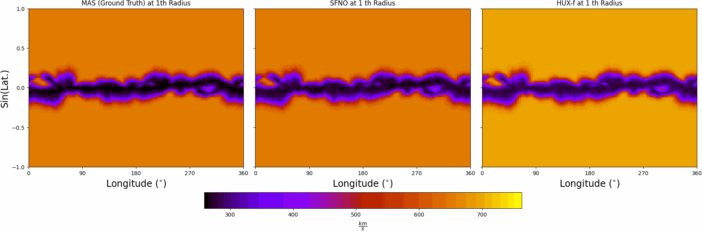

# Toward Data-Driven Surrogates of the Solar Wind with Spherical Fourier Neural Operator

This repository contains the official implementation of the paper **"Toward Data-Driven Surrogates of the Solar Wind with Spherical Fourier Neural Operator"**.  
The project introduces the **Spherical Fourier Neural Operator (SFNO)** as the first data-driven surrogate model for simulating the **radial velocity of the solar wind**.

Traditional numerical models like HUX rely on simplified assumptions that limit adaptability and real-time performance. SFNO learns directly from data in the spectral domain on spherical geometries, offering a flexible and efficient alternative that improves with more data and training.

---

## Highlights

- **Data-driven surrogate modeling** of solar wind radial velocity on spherical shells.
- **SFNO** architecture applied to heliophysics for the first time.
- **Performance competitive with traditional physics-based solvers** across multiple metrics.
- Demonstrates potential for **real-time and scalable space weather forecasting**.

---

## Visual Inspection

Below are sample SFNO predictions for solar wind radial velocity over Carrington rotations:

- **CR2228** — Easiest case for SFNO  
  

- **CR2268** — Representative prediction  
  

- **CR2293** — Hardest case for SFNO  
  

---

## Requirements

Install dependencies from the provided `requirements.txt`:

```bash
pip install -r requirements.txt
```

---